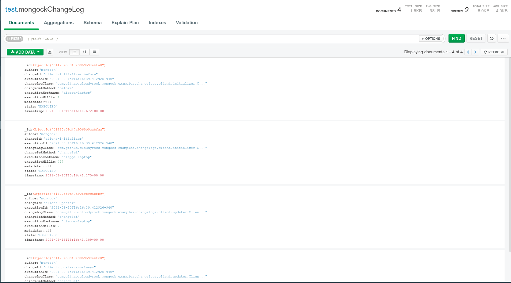

# CLI example

This example shows how to run Mongock with the professional library and rollback the changes with the undo operation, by using the cli.

## Steps to run it
- The following steps assume a MongoDB replicaSet is listening on port 27017. We suggest to checkout [this repository](https://github.com/mongock/mongodb-replset-deployment-docker) and follow the readme to easily setup your replicaset:
- run `cd springboot-springdata-annotation-cli/`
- Build the application  with `mvn clean package` which implicitly generates the mongock script
- Run the application with `java -jar target/springboot-springdata-annotation-cli-1.0-SNAPSHOT.jar`
- Make sure the changeLog collection is populated as shown below

- Run the cli to execute the undo operation with `./mongock undo client-initializer`
- Now, you will probably see two more entries in the `mongockChangeLog` collection, the both rollbacks, the execution and the before in side the class `io.mongock.examples.professional.changelogs.client.initializer.ClientInitializerChangeLog`

## Development notes
- This example uses Mongock version 5. To upgrade easily, please see this [guide](https://github.com/mongock/mongock-driver-mongodb/blob/develop/QUICK_UPGRADE_VERSION_5.md)
- CLI currently only supported for Spring application. We are working to provide the standalone too, and other frameworks as they come.
- The CLI, like the `io.mongock.professional:mongock-springboot` library, are in BETA version.
- For the time being, the version for the professional core and the cli are hardcoded in the pom. We'll soon provide a BOM covering these versions.
- From version 5, the @ChangeLog annotation is deprecated(It will remain in code for backward compatibility though). It has been replaced by @ChangeUnit, which provides, among others, the annotation @RollbackExecution, which is mean to be used mainly in `undo` operation
- To use the Mongock CLI you need to use the maven plugin `mongock-cli-generator` like you can see in the pom.xml file, line 76. This generates the relevant artifacts in the target folder and the script `mongock` in the root folder,  which is the one the user need to execute: `./mongock undo changeUnitId`
- The Mongock CLI is generated by default in the maven `PACKAGE` phase. So you can generate by using `mvn clean install` or `mvn clean package`
- The file `resources/mongock-cli.yaml` is required and should contain the field `mongock.cli.configSources` with the path of the Spring configuration classes, so the CLI can import the required beans. One of the beans should be the Mongock Builder. If you are using the properties approach(@EnableMongock annotation), don't worry about this, is handled by Mongock. Otherwise make sure the Mongock builder bean is injected to the Spring context.

